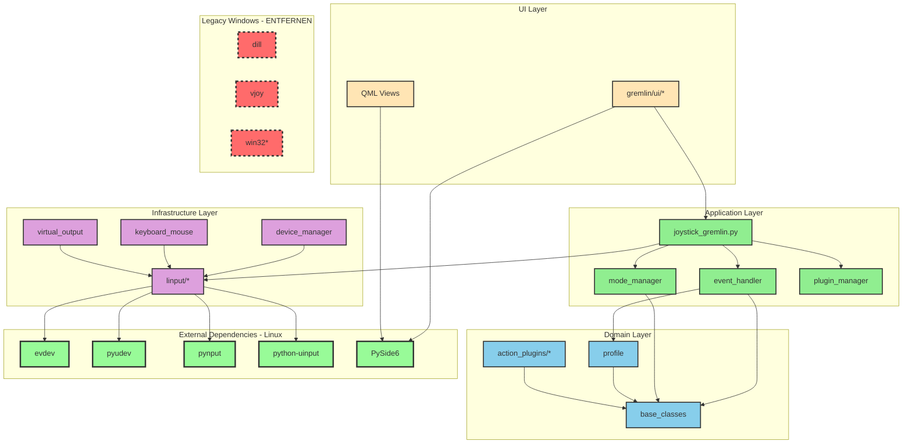
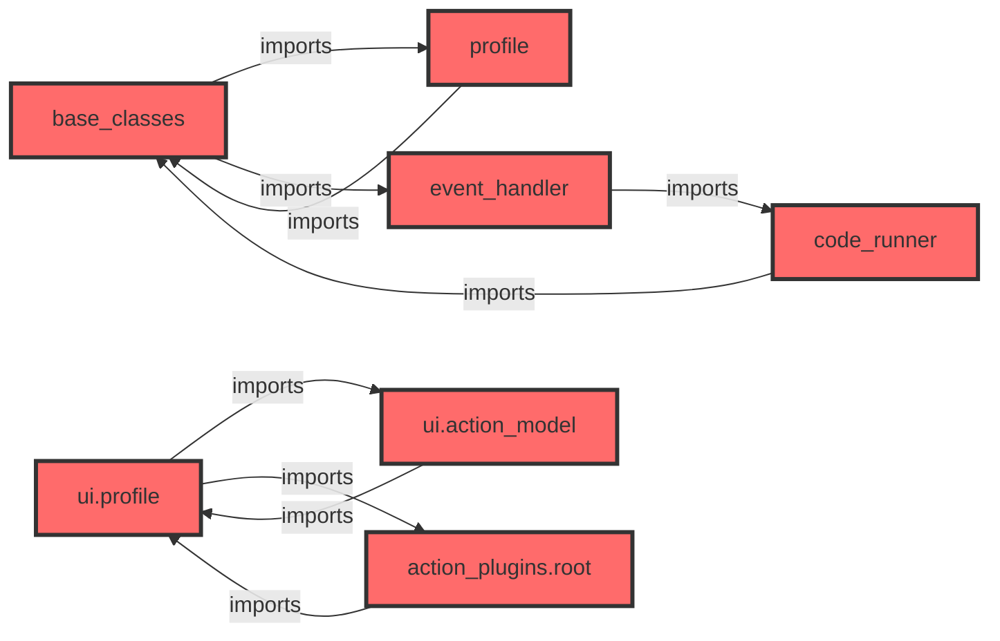
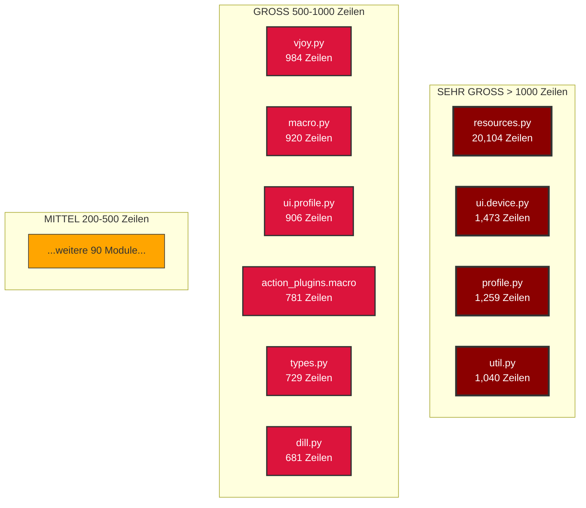
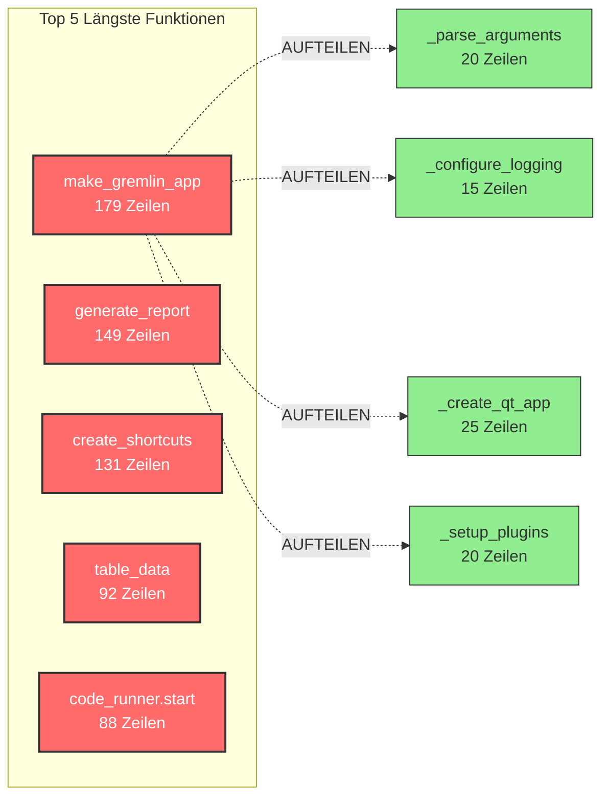
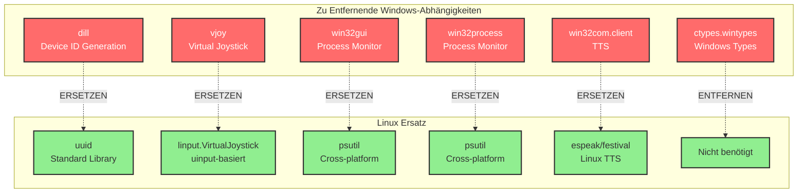
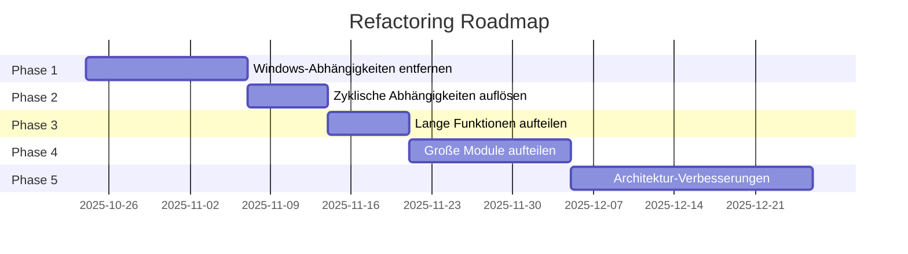

# Joystick Gremlin - Abhängigkeitsvisualisierung

## Hauptmodule und ihre Abhängigkeiten

### 1. Core Architecture



### 2. Zyklische Abhängigkeiten (KRITISCH!)



### 3. Module-Größe Übersicht



### 4. Lange Funktionen (Clean Code Verstöße)



### 5. Windows-Abhängigkeiten Übersicht



### 6. Neue Architektur (Clean Code Refactoring)

```mermaid
graph TD
    subgraph "Presentation Layer"
        V[Views<br/>QML]
        VM[ViewModels<br/>Python]
    end
    
    subgraph "Application Layer"
        APP[Application Services<br/>event_handler, mode_manager]
        BUS[Event Bus<br/>Lose Kopplung]
    end
    
    subgraph "Domain Layer"
        DOM[Domain Models<br/>Profile, Actions, Events]
        INT[Interfaces<br/>IDeviceManager, IVirtualDevice]
    end
    
    subgraph "Infrastructure Layer"
        IMPL[Implementations<br/>LinuxDeviceManager, LinuxVirtualDevice]
    end
    
    V --> VM
    VM --> BUS
    BUS --> APP
    APP --> DOM
    DOM --> INT
    INT <-.implementiert von.-| IMPL
    
    classDef presClass fill:#FFE5B4,stroke:#333,stroke-width:2px
    classDef appClass fill:#90EE90,stroke:#333,stroke-width:2px
    classDef domClass fill:#87CEEB,stroke:#333,stroke-width:2px
    classDef infraClass fill:#DDA0DD,stroke:#333,stroke-width:2px
    
    class V,VM presClass
    class APP,BUS appClass
    class DOM,INT domClass
    class IMPL infraClass
```

### 7. Refactoring Phasen



## Metriken Vorher/Nachher

| Metrik | Vorher | Ziel (Nachher) |
|--------|--------|----------------|
| **Zyklische Abhängigkeiten** | 5 | 0 ✅ |
| **Windows-Abhängigkeiten** | 10+ | 0 ✅ |
| **Funktionen > 50 Zeilen** | 20 | 0 ✅ |
| **Module > 500 Zeilen** | 16 | < 5 ✅ |
| **Durchschn. Kopplung** | 8.5 | < 5 ✅ |
| **Test Coverage** | ~30% | > 70% ✅ |
| **Pylint Score** | 6.8 | > 8.0 ✅ |

## Clean Code Prinzipien

### SOLID
- ✅ **S**ingle Responsibility - Eine Funktion, eine Verantwortlichkeit
- ✅ **O**pen/Closed - Offen für Erweiterung, geschlossen für Modifikation
- ✅ **L**iskov Substitution - Interfaces verwenden
- ✅ **I**nterface Segregation - Kleine, fokussierte Interfaces
- ✅ **D**ependency Inversion - Von Abstraktionen abhängen, nicht Implementierungen

### Weitere Prinzipien
- 📏 **Funktionslänge** < 50 Zeilen
- 📦 **Modulgröße** < 500 Zeilen
- 🔗 **Kopplung** < 8 Abhängigkeiten
- 🎯 **Kohäsion** Hoch (verwandte Funktionen zusammen)
- 🔄 **DRY** Don't Repeat Yourself
- 💡 **KISS** Keep It Simple, Stupid
- 🧪 **Testbarkeit** Dependency Injection, Interfaces

## Zusammenfassung

Die Analyse hat **kritische Probleme** identifiziert:

⚠️ **5 zyklische Abhängigkeiten** die die Wartbarkeit stark beeinträchtigen
⚠️ **10+ Windows-Abhängigkeiten** die noch entfernt werden müssen
⚠️ **20 lange Funktionen** die gegen Single Responsibility verstoßen
⚠️ **16 große Module** die aufgeteilt werden sollten

Der **Refactoring-Plan** adressiert alle Probleme systematisch in 5 Phasen über ca. 2-3 Monate.

Nach Abschluss wird der Code:
✅ Vollständig Linux-nativ ohne Windows-Abhängigkeiten
✅ Keine zyklischen Abhängigkeiten
✅ Alle Funktionen und Module in angemessener Größe
✅ Höhere Testabdeckung und Wartbarkeit
✅ Bessere Architektur mit klaren Schichten
