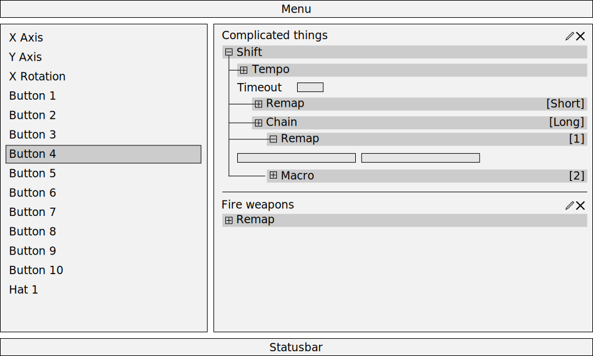
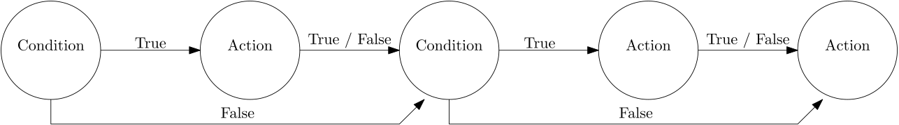
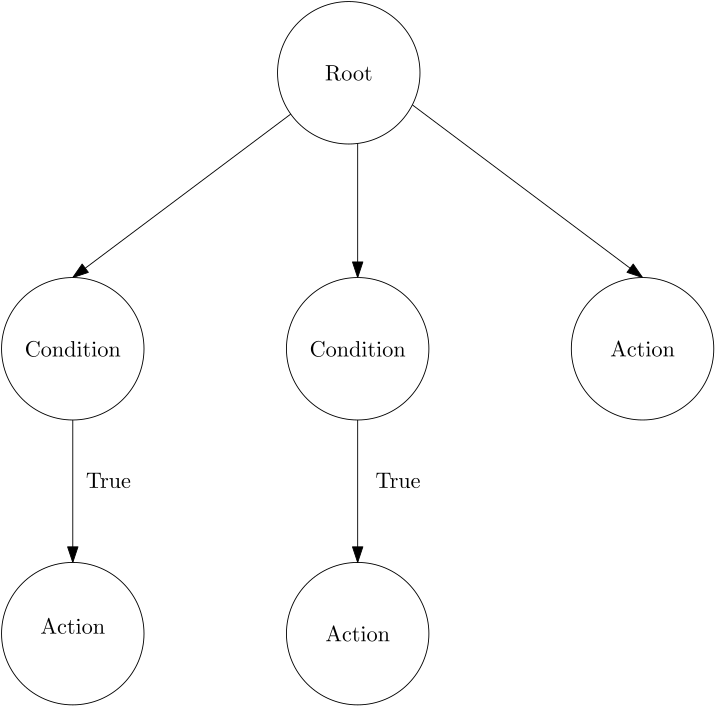
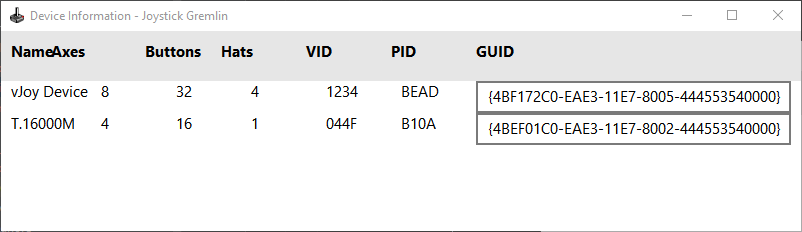
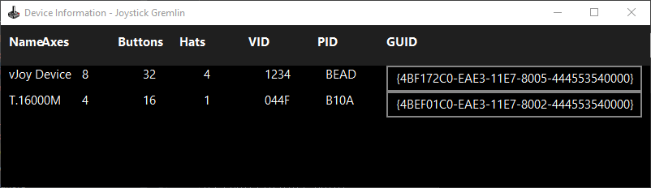

# Gremlin R14 Changes

Initially the main feature for R14 was intended to be a library system, which would allow reassigning and reusing of actions with easy instead of having to recreate the same or similar configurations over and over again. However, as it turns out implementing this properly has a large number of knock on effects which result in a rather massive amount of rework of a large portion of Gremlin, both behind the scenes and user facing UI.
{: style="text-align: justify"}

From a high level perspective the following items will be added or changed drastically with R14, as a consequence of adding the library functionality.
{: style="text-align: justify"}

1. Implementation of an action library system.
2. Redesign of the profile structure to support the library system.
3. Removal of fixed container and action structure to allow composition of library items.
4. Move to an execution tree logic to support more flexible configurations.
5. Complete UI redesign using QML to accommodate the above changes and additions.

Due to the extensive nature of these changes this is a good time for feedback and ideas, as it might be easier to add now or plan for them then to retrofit them later.
{: style="text-align: justify"}

## 1. Action Library

The catalyst for all these changes ([Issue 176](https://github.com/WhiteMagic/JoystickGremlin/issues/176)). The idea behind the action library is allow an action to easily be assigned to another input or duplicated to another input. This means that actions, containers, and conditions instead of being stored in the input they are assigned to are stored independent of inputs in a library and each input simply refers to the set of library entries that are used with it.
{: style="text-align: justify"}

This creates several challenges.

- Virtual button conditions don't make sense to be part of the library entry.
- Certain conditions make sense on the library item while others don't.
- Certain combination of containers and / or actions should not be assignable to all inputs, e.g. *Hats to Button* container or *Response Curve* action.
{: style="text-align: justify"}

This shows that it makes sense for conditions to be used in both the library portion as well as the input portion of a profile and thus have to be able to be used in both places. This type of flexibility was never intended in the existing condition system and thus can't be supported by it. This results in the profile structure having to be reworked.
{: style="text-align: justify"}

## 2. Profile Structure

The XML profile structure will have to change to support the library system, increased complexity of conditions, and more flexible action and container usage. An example XML snippet of what currently a tempo container with two remap actions, one of which has a condition associated with it looks like is shown in the following.
{: style="text-align: justify"}


<button description="" id="1">
	<container activate-on="release" delay="0.5" type="tempo">
    	<action-set>
        	<remap button="1" vjoy="1">
            	<activation-condition rule="all">
                	<condition comparison="pressed" condition-type="keyboard" extended="False" input="keyboard" scan-code="42"/>
                </activation-condition>
            </remap>
        </action-set>
        <action-set>
        	<remap button="2" vjoy="1">
            	<activation-condition rule="all"/>
            </remap>
        </action-set>
    </container>
</button>


Reworking the XML profile to store the configuration in a library whose entries are associated with the physical inputs while also permitting the use of conditions in more flexible ways could look something like the following.
{: style="text-align: justify"}


<button description="" id="1">
    <node type="library-reference">
    	<param name="id" value="{ABCD}"/>
    </node>
</button>
<button description="" id="2">
	<node type="condition">
        <param name="operator" value="and"/>
        <condition>
            <param name="type" value="keyboard"/>
            <param name="comparison" value="pressed"/>
            <param name="scan-code" value="42"/>
            <param name="extended" value="False"/>
        </condition>
        
        <node type="library-reference">
    		<param name="id" value="{ABCD}"/>
    	</node>
    </node>
</button>

<library>
    <item>
        <param name="id" value="{ABCD}"/>
        <param name="label" value="Test"/>
        <param name="description" value="Long description of the test"/>
        
        <root>
            <node type="tempo">
                <param name="delay" value="0.5"/>
                <group type="short">
                    <node type="condition">
                        <param name="operator" value="and"/>
                        <condition>
                            <param name="type" value="keyboard"/>
                            <param name="comparison" value="pressed"/>
                            <param name="scan-code" value="36"/>
                            <param name="extended" value="False"/>
                        </condition>
                    </node>
                    <node type="remap">
                        <param name="vjoy-id" value="1"/>
                        <param name="input-id" value="1"/>
                        <param name="input-type" value="button"/>
                    </node>
                </group>	
                <group type="long">
                    <node type="remap">
                        <param name="vjoy-id" value="1"/>
                        <param name="input-id" value="2"/>
                        <param name="input-type" value="button"/>
                    </node>
                </group>
            </node>
        </root>
    </item>
</library>


This changed XML structure does a few things.

- The plethora of custom XML node types and attributes of these nodes are removed and replaced with a smaller number of more general nodes with clearly defined attributes.
  - `node` general node which represents a single "execution unit" in the new execution tree structure, replaces the existing `container` and action plugin nodes (`remap`, `macro`, etc.).
  - `group` aggregates several `node` entries into a cohesive unit to provide structure, effectively replaces the `action-set` nodes.
  - `param` generic node which holds `(key, value)` pairs that store the settings of the `node` they are children of.
  - `condition` nodes represent a single condition statement used by a `node` representing a condition.
  - `action` holds a single macro action which is used within a `node` with the type macro.
  - `item` simply contains a single library entry.
- The overall structure is no longer restricted to a top level container with a collection of action plugin entries in `action-set` nodes.
- Directly encodes the execution tree structure via the XML's hierarchy.
- Stores action configuration in a library while physical inputs simply hold references to these.
{: style="text-align: justify"}

Some of the above node types might change during implementation. Good candidates for further consolidation are the special `condition` and `action` nodes which effectively group `param` nodes, when a list of configuration entries exist. There is also still some work to be done with figuring out when and where `group` nodes are used and needed.
{: style="text-align: justify"}

## 3. Action and Container Removal

Currently Gremlin has a fixed two layer architecture when it comes to configuring actions, i.e.


<container type="tempo">
    <action-set>
        <remap button="1" vjoy="1"/>
    </action-set>
    <action-set>
    	<remap button="2" vjoy="1"/>
    </action-set>
</container>


This was done to prevent an overly complicated UI design, i.e. how to allow nesting of containers and actions to an arbitrary depth, while also making it harder to construct illogical setups.
{: style="text-align: justify"}

While these two goals were achieved the two layer architecture also creates unwanted limitations. A prime example of this is the inability to use the *Hat to Buttons* container with a *Tempo* or *Double Tap* container. The addition of the library also means that it is reasonable to assume that users will want to put a predefined library item into a container. However, the library item would always be a container of sorts at the highest level and thus, under the current system, could not be added to a new container, say a *Tempo* one.
{: style="text-align: justify"}

For all these reasons the existing two layer architecture, consisting of containers which represent some execution logic and actions which perform an active task needs to be removed. This obviously brings back the two problems mentioned above:
{: style="text-align: justify"}

1. Creating a UI capable of properly handling variable depth nesting of containers and actions.
2. Handling action and container configurations which are illogical.
{: style="text-align: justify"}

The first point hopefully can be achieved with a design similar to the concept below. A tree representation is used to allow collapsing and expanding entries of interest. The tree structure indicates the nesting while the actual configuration parts of the UI all use the same fixed width instead of being indented with the header they belong to. This hopefully conveys execution logic order while maintaining the ability to configure entries easily.
{: style="text-align: justify"}

The second portion I'm less clear on how to handle, as devising strict rules about which combinations will work together and under what circumstances might be impossible. As such I am leaning towards giving the user the power but also the responsibility at the same time. It might be possible to do some simple checks to highlight obviously bad configurations but that remains to be seen.
{: style="text-align: justify"}

## 4. Execution Tree

Joystick Gremlin currently transforms the configuration associated with a physical input into what is internally called an execution graph. The graph effectively decides what parts of the configuration are executed based on device and system state information.
{: style="text-align: justify"}

For a simple setup, say a button that performs an action on both button press and release and then does something different in addition each time the button is pressed or released the execution graph looks as follows:
{: style="text-align: justify"}

One of the `condition` nodes ensures that the following `action` is only performed when the button is pressed, while the other `condition` node ensures the `action` node next to it runs only when the button is released. The last `action` node will always run, no matter the button's state. While this graph structure works it is an overly complicated way to encode what effectively is a tree like structure, as shown below.
{: style="text-align: justify"}

This tree represents the same logic flow as the graph, however, it is easier to see that the three actions are independent of each other and can't influence each other's execution. As the profile structure is being redesigned into a tree like structure, having the internal execution logic mimic this will make the mapping between what the user sees, what the XML contains, and what happens much clearer and hopefully easier to understand.
{: style="text-align: justify"}

## 5. UI Redesign

The current UI is implemented using plain Qt via the PyQt bindings. The majority of the UI elements are constructed, initialized, updated, and processed directly via Python code. While this works it also leaves open a lot of room to implement things in an improper way (which has been done in many places). The drawback of this is that changes are time consuming and the UI code isn't exactly easy to follow.
{: style="text-align: justify"}

An alternative is QML, which uses the same underlying technology, i.e. Qt, however, forces a much stronger separation between backend logic (Python code) and presentation and user interaction (QML which is effectively XML and JavaScript). Switching to this conceptually has a few benefits.
{: style="text-align: justify"}

- Harder to take shortcuts which are bad long term
- Cleaner separation between logic and presentation / interaction
- "Modern" interface look (i.e. Windows 10 like)
- Dark mode or any other color combination directly supported
- Creating action plugins and their UI might be much simpler

There are also some obvious drawbacks of doing this

- Entire UI has to be redone
- "Modern" interface look (i.e. Windows 10)
- Figuring out best way to do things and the limitations

While the drawbacks might cost quite a lot of time to overcome / resolve the fact that a central part of the UI has to be redone in any case to support the removal of container and action limitations as well as support for the library system makes this a rather good point in time to do this.
{: style="text-align: justify"}

Examples of the change in look can be seen below on the example of the Device Information dialog. First up are the current visuals from R13.
{: style="text-align: justify"}

Next up is the same dialog but redone using QML both in the light and dark theme. QML provides a range of styles that can be used which changes the look of various UI interfaces, for this the [Universal Style](https://doc.qt.io/qt-5/qtquickcontrols2-universal.html) which attempts to mimic the Windows 10 look and feel.
{: style="text-align: justify"}

## 6. Complex Example

An example of a more complex setup that is possible with the new profile is shown below, first in tree form and then as the corresponding XML.
{: style="text-align: justify"}

The XML encoding the above execution tree looks as follows.


<library>
    <item>
        <param name="id" value="{1234}"/>
        <param name="label" value="Complex example"/>
        <param name="description" value="Showing off the more complex configurations that the new system should allow for."/>
        
        <node type="tempo">
            <group type="short">
                <node type="Remap">
                    <param name="vjoy-id" value="1"/>
                    <param name="input-id" value="4"/>
                    <param name="input-type" value="button"/>
                </node>
                <node type="Macro">
                    <param name="repeat" value="toggle"/>
                    <param name="delay" value="0.25"/>
                    <param name="exclusive" value="False"/>
                    <action>
                        <param name="action-type" value="vjoy"/>
                        <param name="vjoy-id" value="1"/>
                        <param name="input-type" value="hat"/>
                        <param name="input-id" value="2"/>
                        <param name="value" value="NE"/>
                    </action>
                    <action>
                        <param name="action-type" value="mouse-motion"/>
                        <param name="dx" value="12"/>
                        <param name="dy" value="32"/>
                    </action>
                </node>
            </group>
            <group type="long">
                <node type="Chain">
                    <param name="timeout" value="1.0"/>
                    <group type="1">
                        <node type="Remap">
                            <param name="vjoy-id" value="1"/>
                            <param name="input-id" value="12"/>
                            <param name="input-type" value="button"/>
                        </node>
                    </group>
                    <group type="2">
                        <node type="TTS">
                            <param name="text" value="This is a test"/>
                        </node>
                    </group>
                    <group type="3">
                        <node type="condition">
                            <param name="operator" value="and"/>
                            <condition>
                                <param name="type" value="keyboard"/>
                                <param name="comparison" value="pressed"/>
                                <param name="scan-code" value="36"/>
                                <param name="extended" value="False"/>
                            </condition>
                        </node>
                        <node type="Macro">
                            <param name="repeat" value="None"/>
                            <param name="exclusive" value="False"/>
                            <action>
                                <param name="action-type" value="joystick"/>
                                <param name="device-guid" value="{...}"/>
                                <param name="input-type" value="axis"/>
                                <param name="input-id" value="4"/>
                                <param name="value" value="-0.52"/>
                            </action>
                        </node>
                    </group>
                </node>
            </group>
        </node>
    </item>
</library>

